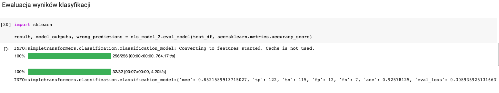

# Wyniki treningu na dostarczonym modelu


\

Na dostarczonym modelu danych osiągnięta została skuteczność na poziomie 92,56%

# Wyniki eksperymentów

## Zmniejszenie grupy testowej

\

Jako pierwszy eksperyment postanowiłem zmienić rozmiar grupy testowej do połowy. Liczbę epok treningowych zostawiłem tutaj taką samą, jak dla przykładu tj. 5

\

Skuteczność: 89,90%, czyli nieco niższa niż w przykładzie, aczkolwiek spodziewałem się znacznie większej utraty skuteczności. Zostało utracone jedynie 2,5 p.p. przy usunięciu 40% danych testowych.

## Zmniejszenie ilosc epok treningowych

\

\

Następnie wróciłem do grupy testowej o rozmiarze 0,9, ale z kolei ograniczyłem liczbę epok do jedynie trzech - chciałem zobaczyć, jaki to będzie miało wpływ na wyniki.

\

Skuteczność: 89,84%, niemal taka sama, jak przy poprzednim teście. 

## Duża ilość epok testowych 

W ostatnim eksperymencie postanowiłem zwiększyć ilość epok treningowych do aż 9, ale nie poprawiło to wyników, a wręcz pogorszyło je o niecałe pół punkta procentowego.

\

Skuteczność: 92,18%

## Podsumowanie eksperymentów

rozmiar batcha | liczba epok | skuteczność [%]
-- | -- | --
0,9 | 5 | 92,56
0,5 | 5 | 89,90
0,9 | 3 | 89,84
0,9 | 9 | 92,18

Podsumowując - różnice nie są duże, osobiście zmieniając hiper-parametry o stosunkowo duże wartosci spodziewałem się równie dużych różnic w wynikach, które jednak się nie pojawiły. 

# Zbiór danych

Moim zbiorem danych są posty z forum 4programmers.net, a konkretnie z działów *Kariera* i *Edukacja*. Są to działy bardzo do siebie podobne, więc przed klasyfikatorem stało naprawdę trudne zadanie. Jestem pewien, że nawet człowiek nie miałby wyników powyżej 90%.

API 4programmers jest niestety dość ubiogie, więc wykorzystując pythonowe moduły *requests* i *bs4* scrapowałem dane z forum.

## Zbieranie linków do postów

```python
def get_links_from_page(topic, page):
    topic_url = f'https://4programmers.net/Forum/{topic}/?page={page}'
    resp = requests.get(topic_url)
    r = re.findall(r'https:\\/\\/4programmers.net\\/Forum\\/' + topic + r'\\/[^"?]*', resp.text)
    return list(set(map(lambda x: x.replace('\\', ''), r)))
```

Taki fragment kodu odpowiadał za zebranie linków ze strony. Zdecydowałem się na wykorzystanie regexów, ponieważ linki były umieszczone wewnątrz zmiennej JS, więc na nic mi się tu mógł przydać *bs4*. Tę funkcję wykonałem dla pierwszych 25 stron z kategorii Edukacja i Kariera, co dało mi łącznie 1000 linków do postów, po 500 z każdej kategorii.


## Pobieranie treści posta

```python
def get_post(link):
    link = link.replace('\\', '')
    resp = requests.get(link)
    soup = BeautifulSoup(resp.text, 'html.parser')
    content = soup.find('div', class_='post-content')
    return content.get_text().replace(';', '').replace('\n', ' ')
```
Do pobierania treści posta wykorzystałem już bibliotekę *bs4*. Usuwałem też z treści średniki oraz znaczniki nowej linii, aby nie *zepsuć* pliku CSV. 


## Zpisanie do pliku CSV

Całosć zapisałem do pliku CSV w formacie `Kategoria;treść`. 


`$ head -n 4 posts.csv`


```
topic;post
Kariera; Ile by Wam zajęło zrobienie takiego zadania https://github.com/perseusEng[...]ckend-challenges/user-service 
Kariera; Patrząc na ten artykuł można się szykować powoli powrotu do mordoru - jak u Was wygląda sytuacja? Macie już jakieś pierwsze informacje o powrocie do mordoru? https://warszawa.naszemiasto.[...]zie-wygladala-w/ar/c1-7671255? 
Kariera; Tytuł wątku nie jest przypadkowy. B2B stało się niesamowicie popularne a już zwłaszcza w świecie IT. ...
```

Zbiór jest do pobrania tutaj: https://github.com/gregxsunday/msi-text-clasification/blob/master/posts.csv

# Mój model

\

W moim zbiorze znalazło się 501 postów z kategorii Kariera i 500 z kategorii Edukacja.

\

Zbiór podzieliłem w stosunku 1:9. Zdecydowałem się na 5 epok treningowych. Były to parametry, dla których na testowym zbiorze osiągnąłem najlepsze wyniki.


## Wyniki

\

Skuteczność: 71,29%

Uważam to za bardzo dobry wynik - wybrane przeze mnie grupy bardzo na siebie nachodzą, a użytkownicy czasem sami piszą w złym miejscu, więc jestem pod wrażeniem, że udało się sklasyfikować posty z taką skutecznością.

\

